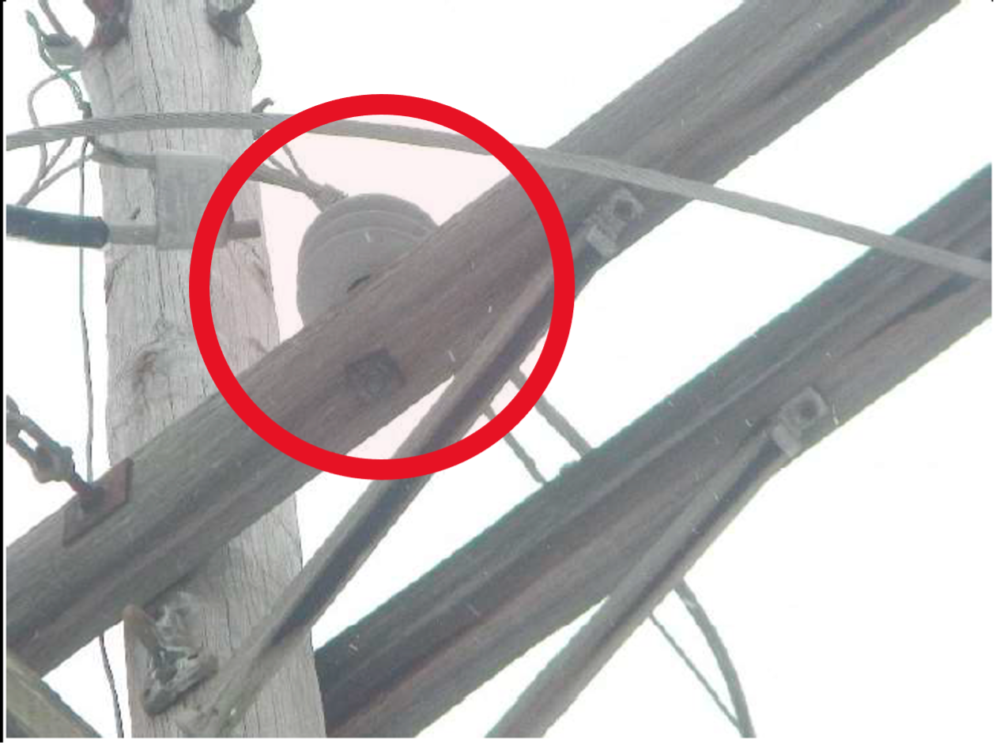
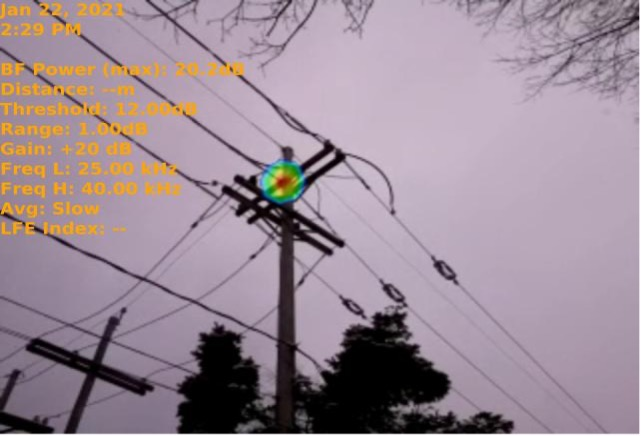
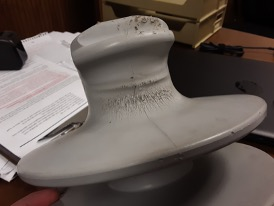
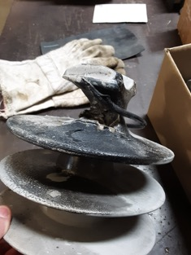

## Polymeric Insulator Defects PD with SonaVu

From the power generation facility to eventual points of use, the transmission and distribution of electricity includes many waypoints. Along the way, the job of supporting and separating electrical conductors without allowing current to pass through falls upon the polymeric insulator. Insulators come in many shapes, sizes, and materials. Composite materials containing silicone rubber represent one of the most widely deployed polymeric insulator types. They are chosen on their ability to withstand a variety of harsh environments including hot desert climates as well as variable temperature regions such as those found in Canada, the northern United States, as well as Europe. 

While climate plays a role in the degradation of polymeric insulators, it is not the only factor contributing to their shortened longevity. Partial discharge of electrical current also plays a role in their early demise. 

Partial Discharge (PD) is a localized electrical discharge or spark in an insulation system that does not completely bridge the gap between two conducting electrodes.  It can occur in any point in the insulation system, where the electric field strength exceeds the breakdown strength of that portion of the insulating material. PD is a reaction which occurs at an atomic level. The movement of electrons ionizes the air molecules at locations of high stress. Ionization splits the oxygen molecule to create ozone and nitrous oxide which, alone in their normal states are generally harmless. But when they are mixed with water vapour, they become corrosive. If you’ve ever walked into a substation and noticed the smell of ozone, then you have witnessed the presence of partial discharge firsthand.

Polymeric insulators are built to withstand harsh climates and vast temperature swings. To an extent, they can even withstand the presence of PD. But every asset has its breaking point and the corrosive nature of PD eventually degrades polymer insulators too. That’s why frequent condition monitoring is so important to gauge their remaining life.

Ultrasound and infrared thermography are two technologies that have become synonymous with inspections and condition monitoring of electrical assets. Infrared is revered for its ability to see heat traces at safe distances while ultrasound is preferred for its ability to hear partial discharge in the form of corona, arcing, and surface tracking. New technology in the form of Acoustic Imaging Cameras, such as the SonaVu powered by SDT Ultrasound Solutions, are gaining favour for their ability to spot PD anomalies from safe distances in any light condition. 

The SonaVu is an acoustic imaging camera that hears sources of ultrasound from fifty metres or more distance, then visualizes the sound on a full colour image or video. Equipped with 112 digital MEMS sensors, operators can both see the ultrasound source while listening to it through a heterodyned circuit and Bluetooth headphones. The images or videos are stored to memory and transferred to PC for easy report generation. 

A diagnostic report on a substation in Erie, Pennsylvania was recently conducted by Craig Casler, principle technical inspector with Absolute Infrared Inspection Services. Casler was called in to inspect a variety of assets within the substation including transmission and distribution lines fitted with polymer insulators. His technologies include both infrared cameras and ultrasound detection systems. An inspection with his SonaVu Acoustic Imaging Camera safely revealed insulations degradation from the ground.

Polymer insulators such as the one pictured here are ubiquitous in the electrical power transmission and distribution world. Casler was quick to spot it as a source of partial discharge and confirmed the source of the PD on his SonaVu. While Craig is a seasoned electrical inspector, well-trained in the use of infrared and ultrasound, this was only his second time conducting field inspections with his SonaVu. He received one-hour of virtual online training on the SonaVu prior to using it in the field. This speaks to the ease of use of modern technologies and short learning curves.

As part of his client report, Casler’s recommendation included corrective action in the form of cleaning or full replacement of affected components. It is well-known that ultrasound detects the presence of PD at very early stages. Since inspections are done routinely on this substation and the PD was not present during previous inspections, it was concluded that the defect was at an early stage and corrective action, while necessary, was not urgent. There was time to plan the repair.

Often times an inspector conducts his work and never knows the good he created. In this case however, Craig’s customer was appreciative and shared their findings. After the planned outage to replace the polymer insulator, the customer took this photo and shared it. Closer examination shows how the corona effect corroded the polymer coating. Look closely at the lines tracing downward from where the cable rests. This is destructive surface tracking.

Like so many assets, run-to-failure is often the only reliability strategy employed. When corona and other forms of partial discharge are left unchecked, or not part of routine condition monitoring, catastrophes do happen. The burning around the insulator in this image was caused by the same PD activity shown previously. The only difference is that it was left undetected. Maintenance was reactively carried out on an emergency basis with collateral damage to the power lines. Worse than that however, the fire caused damage to a key transformer and resulted in a plant wide shut down.

Unreliable electric power systems not only cost millions of dollars in downtime and repairs, they have the potential to maim and kill. Reliability leadership must focus on the preservation of both physical and human assets. Ultrasound represents a safe, easy, reliable technology for assessing the presence of risk and the need for maintenance intervention. It is a low-cost technology with a short competency curve. 
