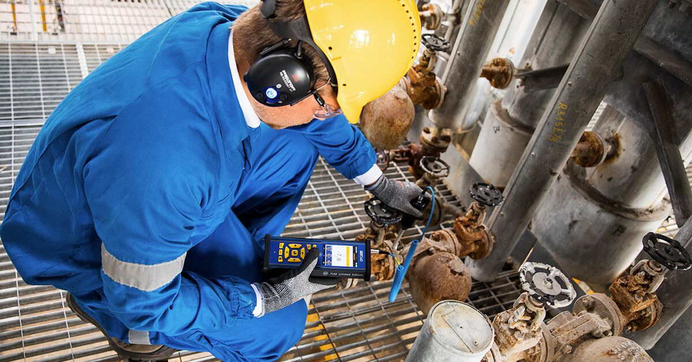
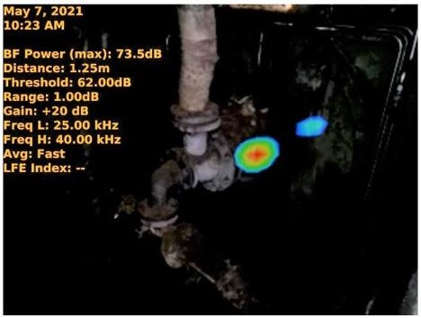

***

What is the proper technique for performing steam trap inspections? My short answer never changes. It involves two readings… One taken few feet upstream of the steam trap to ensure there is flow, and the the other reading taken immediately after the steam trap. If the steam trap is operating correctly, you will hear it cycle. Ultrasonically, this means the signal downstream of the steam trap should be silent, followed by intermittent increases in dBµV levels, indicating a discharge.

By listening to a steam trap cycle this way, ultrasound technicians can determine if the steam trap is cycling properly and functioning as it should. Technicians will also be able to determine any linkage issues the steam trap may be facing.

Over the years, I have found issues with this inspection method. The most glaring issue being that steam traps vary widely in cycle times. This leads to inconsistent and unpredictable inspection times. While this is more of a nuisance than anything else, it still makes inspectors think twice about performing inspections and predictive maintenance interventions on steam traps – especially when considering most steam traps can be replaced for a few hundred dollars.

## What do unmaintained Steam Traps Cost You?

> Is it a waste of time, money, and resources performing condition monitoring and implementing predictive maintenance interventions on an asset with such a low replacement cost?

No! It is not a waste of time, money, or resources. Your steam system, and the steam traps that comprise them are designed to deliver clean steam from the boiler rooms to the intended point of use as efficiently as possible. And steam is not a cheap industrial resource to create.

> The heat energy required to convert water to steam is measured in British Thermal Units. One BTU raises the temperature of one pound of water, by one-degree Fahrenheit. Which means when a pound of steam condenses back to water, one BTU was wasted.

Your steam system should minimize steam loss, maximize the transfer of heat, and remove condensable and non-condensable gasses that make your steam impure. When the assets that make up your steam system are ignored, your steam systems components degrade, your steam systems efficiency deteriorates, and eventually your steam system won’t be able to deliver on its engineered purpose.

Failures in your steam system result in  lost steam through leaks and lost steam when it condenses back to water vapor, and lesser quality steam reaching its intended point of use. Failures in your steam system also mean more greenhouse emissions as a result of having to produce more steam to compensate for losses.  The bottom line… Poorly maintained steam systems result in more losses than that of just the price of replacing parts. 

## Safely Inspecting Steam Traps

Before going further, I would first like to point out that steam is a dangerous commodity. Maintenance personnel, factory workers, and condition monitoring technicians need to be aware that steam has both pressure and temperature… not to mention it's also invisible. When you see what most people call “steam,” it’s actually just water vapor that has cooled down and condensed back to water – and it’s not overly dangerous.

Invisible steam leaks, on the other hand are very hot, very dangerous, very high pressure, and very INVISIBLE. They can burn through clothes and melt human flesh. Which is why I always strongly recommend technicians going out to monitoring steam traps wear the proper PPE. That means wearing long sleeves, gloves, eye protection, and any other articles of PPE that are mandated for that location of your facility.

Before I enter an area where there might be live steam leaks, I like to preform an airborne ultrasonic inspection of the area. The best tool for this is the SonaVu™ Acoustic Imaging Camera, as it not only locates steam leaks in your steam system, but it also visualizes any potential danger on screen.

After performing an airborne ultrasound inspection and confirming there are no dangerous steam leaks, I can proceed with my contact ultrasound inspection on the steam traps I intend to monitor.

## Using a Contact Sensor for Steam Trap Inspection

When new technology first hits the market, predictable buying patterns emerge. Manufacturers love the early adopters; leading edge consumers who are always first to own the latest and greatest gadgets the market has to offer. These mavens serve as a proving ground for new tech and often, their input helps steer the development for second and third product generations. Early adopters exist in sharp contrast to the “wait and see” crowd.

If you don’t have a needle sensor, and are using a magnetic mounted sensor, or a threaded sensor it is important to remember to carefully remove the sensor immediately after inspection. The environmental operating temperature of these SDT sensors is 13 degrees Fahrenheit to 104 degrees Fahrenheit. Steam within a steam system that is 100 PSI is around 338 degrees Fahrenheit. Limiting your sensors exposure to this temperature is necessary for prolonging sensor life. The same goes for other ultrasound sensors.

So, back to inspecting steam traps. Here is a relatively simple inspection that will quickly tell the operator if the steam trap is experiencing a failure mode, and if so, which failure mode.

## A Steam Trap that is Failed Closed

A great way to determine if a steam trap is failed closed is using your ultrasound detectors built in spot radiometer to measure the traps temperature. Most sophisticated ultrasound data collectors have a spot radiometer for recording and measuring temperature readings.

Using my SDT340’s Spot Radiometer, I am checking to see if live steam has reached the steam trap. If the steam trap is failed closed, condensate will have gathered near the opening of the steam trap, reducing the temperature of the trap.

While preforming this inspection, you must consider heat transfer. Heat transfer is simply how much thermal loss occurs from the inside of the piping system to the outside of the piping system, where you are taking your temperature readings. It is safe to assume that there will be about a 10% thermal loss from the interior of the steam system to its exterior. Therefore, I would expect my 100 PSI steam system which is internally 338 degrees Fahrenheit to show an external temperature of around 300 degrees Fahrenheit

## A Steam Trap that is Failed Open

Once you’ve concluded your steam trap is not failed closed, you must check for the other common steam trap failure mode – failed open. 

Using an ultrasound detector,  determining if live steam is getting past the steam trap and dumping into the condensate system is an easy process. You are simply trying to detect turbulent flow inside the steam system's piping. 

Take your contact ultrasound probe and touch it to the upstream side of your steam trap. You are looking for any inherent background ultrasonic signatures in the system. Now touch your contact sensor to the downstream side of the trap and listen. What you should expect to hear on a functioning steam trap is an ultrasound signal less than or equal to the original ultrasound reading taken upstream. If the ultrasonic signal is significantly louder on the downstream side of the trap, you are listening to the steam trap discharge. If it continuously discharges, congratulations, you have found steam trap that is just blowing money into your condensate system.

To put it into a few succinct words, if a steam trap is hot and quiet, it is working correctly.