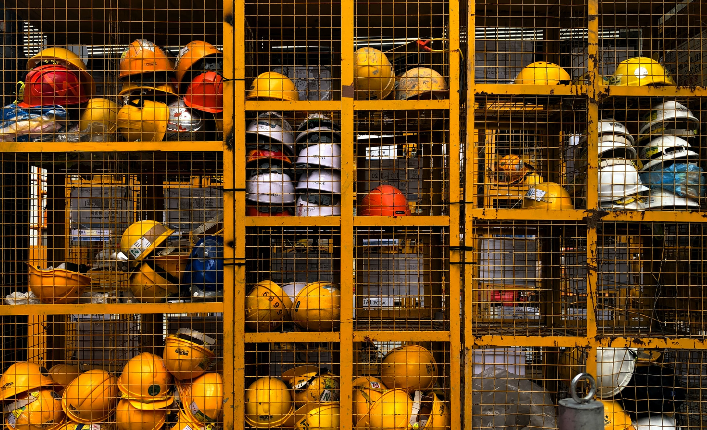
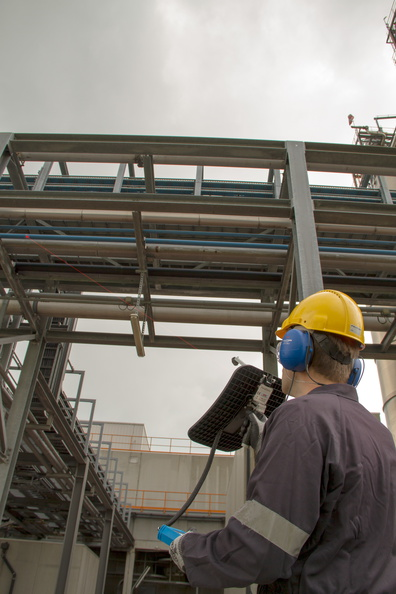
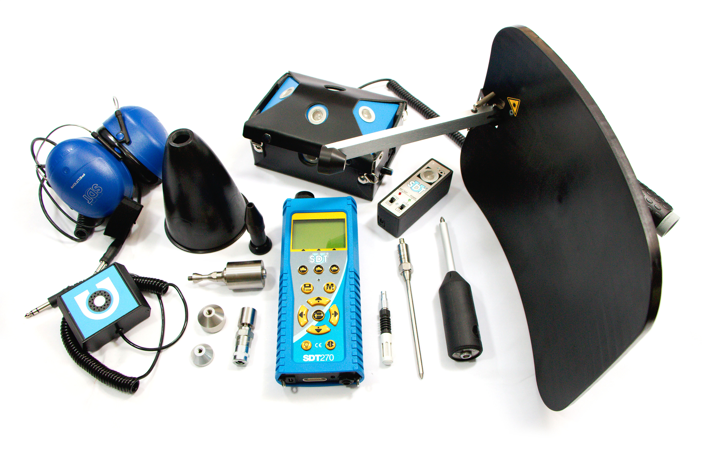

Paul Klimuc is an Ultrasound expert with SDT Ultrasound Solutions. Paul has over 40 years of experience. In 1994, Paul transitioned exclusively to using ultrasound technology for condition monitoring and predictive maintenance. He has experience dealing with a wide variety of industries, including (but not limited to) Aircraft, Auto, Food, Steel, Power Generation and Tobacco. 

Paul began his career as an NDT technician, where he was Level 2 certified from ASNT (American Society for Non-Destructive Testing) in Radiography, Magnetic Particle Inspection, Dye Penetrate Inspection, Visual Inspection, Ultrasonic Thickness Testing and Ultrasonic Flaw detection. His work included testing and inspection services for Nuclear Power generation, Petrochemical process, pharmaceutical manufacturing, and Steel manufacturing.

**The following is a dialogue that Paul had with his students during the fourth Live Online Level One Ultrasound Certification Course.**

***

## Question: Should Compressed Air Leak Inspections be Performed During Planned Outages?

>I am often asked about compressed air leak inspections… how often should compressed air leak inspections be carried out, should they occur during planned outages or regular operation hours, should the whole plant be inspected at once or should it be broken up into smaller more manageable sections.

>Here are my recommendations for carrying out a successful compressed air leak inspection.

*** 

### Safety

>Safety is everyone’s number one job. Which is why I open every one of my LOLO Courses with the Poll Question, which profession suffers more casualties every year in the United States: Maintenance Workers or Firefighters? The answer is surprising to some. Even when performing a task as straight forward and “safe” as performing a compressed air leak survey, it is important to wear the correct PPE, ear plugs, safety glasses, etc. And always remain aware of your surroundings.

*** 

### Frequency of Inspection

>Leak inspections are not a one and done task. They must be performed periodically, and it’s best if they’re broken up by dividing the plant into smaller more manageable sections and performing surveys individually (More on that later).

>According to the Department of Energy, compressed air systems that have been more than a year without inspection and maintenance are likely losing upwards of 35% of their compressed air to leaks. 

>So, when is the best time to perform compressed air leak surveys and inspections? During planned outages and shutdowns? No. 

>Ultrasound can be used effectively in extremely loud environments. The background roar of a production facility doesn’t impede its ability to locate the hissing produced by compressed air leaks. Also, if assets aren’t in operation, automated valves that close when production is down would affect compressed air supply throughout the facility, rendering the results of an air leak survey inaccurate.

*** 

### Knowledge of the Network

>Knowing the network will improve the speed and efficiency of compressed air leak surveys, while also familiarizing the inspector with potential safety hazards. 

>The best way to get to know your compressed air network is to walk the inspection route prior. In a perfect world you will be able to get your hands on schematics that illustrate piping locations, and the route the compressed air flows. 

>Before beginning your ultrasonic inspection, you should have an idea of what type of challenges you will face, and which sensors you will want to use during your inspection. 

*** 

### Update Plans

>As with anything, your compressed air leak survey route is subject to change. Inspectors should always be looking for ways to make their routes safer, more efficient, and effective.

>Additionally, if you were able to get your hands on plant schematics, it is important to document any discrepancies found between the plans and reality for future reference.

*** 

### Plan the Inspection	

>As previously mentioned, you should be further breaking down your facilities compressed air system into smaller sections to tackle one at a time. This makes the task of performing a full compressed air leak audit more manageable. We recommend starting in the compressor room and working your way out.  

>We recommend defining the route using plans and diagrams with as much detail as necessary for other inspectors to follow. 

>You should also coordinate with the production supervisor so you can perform the inspection at an opportune time. The ideal time to perform the inspection is when there is low demand on the compressed air system, ensuring maximum pressure therefore making leaks easier to locate.

>Having knowledge of the most likely points compressed air leaks occur is also extremely beneficial.

[Checkout the following list of the Top 10 Most Common Air Leak Spots.](https://www.sonavu.com/compressed-air-system/)

*** 

### Choosing your Equipment

>Select an ultrasound tool and the attachments that best fits your needs for the inspection. 

>For example, you may want to use a parabolic dish if the piping you’re trying to inspect is far above your head on the ceiling, or you may want a flexible sensor if there are machines or other obstructions in the way of piping you’re trying to inspect.

>**The 5 stages of Leak Management**   
>* Inspect
>* Detect
>* Tag & Document
>* Repair
>* Confirm

*** 

### Data management		

>When recording compressed air leaks in your database there are some things you want to make sure are recorded. For yourself, you should be recording the date and time the survey was performed, the locations of found leaks, leak tag numbers, and leak descriptions. 

>Using [SDT’s Leak Reporter App](https://sdtultrasound.com/products/software/leakreporter/), leaks can be quantified using decibels and then their approximate cost is calculated. This can be helpful to show to management to justify performing regular compressed air leak inspections. 

*** 

### Celebrating Wins

>Now I know it sounds hokey…but don’t forget to celebrate successes… brag a little. It can be as simple as putting up a graph showing realized savings from compressed air leaks repaired. Saving your company money and improving plant wide sustainability should always be celebrated by the maintenance teams – and judging by the sorry state of some facilities compressed air systems, the savings realized by a single compressed air leak survey canbe in the tens, if not hundreds of thousands.
