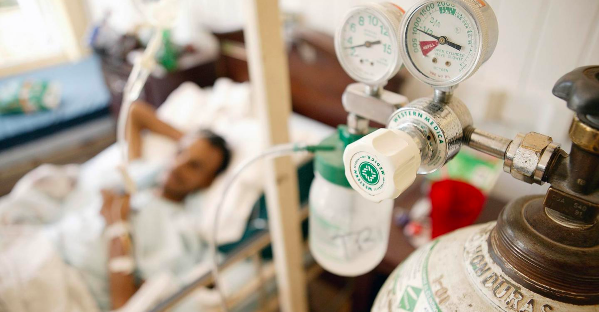
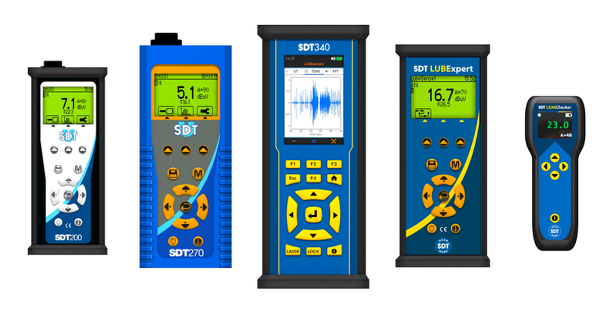
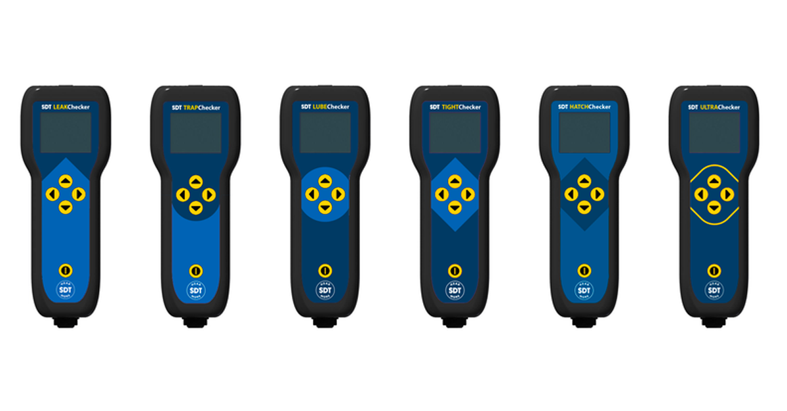
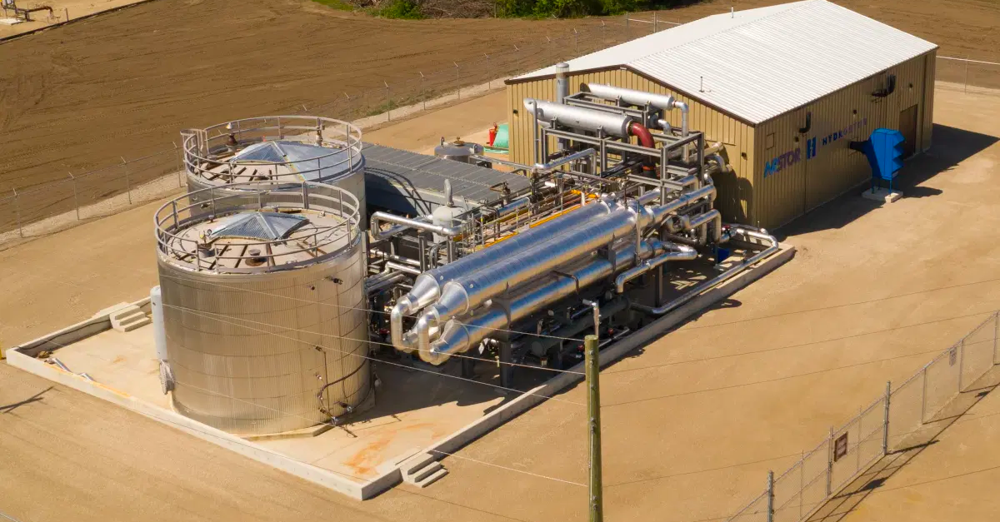

## Compressed Oxygen Leak Interrupts Ventilator and Oxygen Support Amid COVID-19 Crisis

On Wednesday, April 21st, twenty-four critical COVID-19 patients at Dr. Zakir Hussain Hospital in Nashik, Maharashtra died when a valve malfunction disrupted one of the hospital’s main oxygen supply tanks. Of the 157 COVID-19 positive patients at Dr. Zakir Hussain Hospital, 61 were in critical condition, requiring additional oxygen and ventilator support. 

At around 10 AM Indian Standard Time, one of the hospitals main oxygen supply tanks hit its critical refill point at 25% capacity. The oxygen tank had depleted quickly and unpredictably at a bad time. Oxygen is in extreme high demand across India, but especially in the state of Maharashtra, which is the hardest hit state in India in terms of COVID-19 cases and fatalities. Maharashtra is also currently suffering from an acute oxygen shortage.

While the increased usage of oxygen among hospitalized COVID-19 patients is the likely and easy explanation for the tanks rapid depletion – another possible cause is leaks throughout the hospitals compressed gas system and distribution lines.

As hospital staff were thrust into reactive mode, trying to hastily refill the oxygen tank, a socket on the side of the tank broke, resulting in a massive disruption of the vital oxygen supply to many COVID-19 patients. 

The liquid oxygen inside the storage tanks is housed at a temperature of around -180℃. There is immense pressure on the walls of the tank, with explosive potential. When the socket broke, the liquid oxygen depressurized, quickly turned to a gaseous state, flooding the oxygen storage facility with thick plumes of white smoke; A result which could have just as easily been catastrophic given the wrong circumstances, due to the explosive nature of compressed gasses. 

Emergency crews were immediately dispatched to the hospital to assist in patching the oxygen leak. Upon arrival, they were faced with the additional adversity of locating the leak in the low visibility storage area under time constraints. 

Upon arrival, they faced additional adversity. With visibility in the storage area impaired by smoke, pinpointing the source of the O2 leaks proved next to impossible. By the time emergency crews stopped the leak, restoring normal oxygen flow to the hospital, some COVID-19 patients were without oxygen and ventilator support for over half-an-hour. Twenty-four perished. 

In reaction to this incident, Ajit Pawar, the Pune District Guardian Minister instructed officials to perform safety audits on all oxygen tank and supply pipelines at hospitals within the city and district. Why is tragedy so often the siren call for the adoption of common sense standard operating procedures?

## Ultrasound Condition Monitoring Helps Maintain your Most Critical Assets

SDT Ultrasound Solutions has been listening to the needs of their customers in industry for nearly 50 years. SDT Ultrasound Data collectors allow users to monitor friction and impacting on mechanical systems, and turbulence caused by costly leaks of compressed air and other compressed gasses.

Overtime the components of a compressed gas system degrade. As compressed gas lines, storage containers, pneumatic cylinders, pressure regulators, valves and other varying components break down, leaks become more frequent. However, compressed gas systems are often leaking long before significant pressure drops are noticed by maintenance and reliability teams. Chances are, if a compressed gas system has gone a year or more without maintenance, it can be losing up to 40% of its contents to leaks. 

Compressed air leaks are often overlooked in industry because they usually don’t affect production, negatively affect product quality, or pose a safety threat. While a lackadaisical approach to maintaining a compressed air system isn’t ideal from a sustainability or financial standpoint, maintenance personnel can still get away it. However, this isn’t ever the case for compressed oxygen in hospitals. The only option to ensure the safety of patients is 100% uptime and reliability. A hospital’s compressed oxygen systems must be held to the highest standard, inspected regularly, and maintained accordingly to ensure a steady and reliable stream of oxygen can be distributed throughout the hospital to patients in need.

Ultrasound detectors are particularly adept at locating leaks on highly pressurized gas systems. When a gas transfers from an area of high pressure (in the transportation line), to an area of low pressure (the open atmosphere), it creates ultrasonic turbulence. This ultrasonic turbulence can be heard with an SDT Ultrasound Data Collector, and even visualized using the SonaVu™ Acoustic Imaging Camera. 

SDT Ultrasound Solutions has been preaching the necessity of performing compressed gas leak surveys since its inception. They help reduce emissions, save money, and in some cases protect the safety and well-being of employees… and hospital patients.

While instances like the one in Nashik are rare, they are possible, and when they occur… tragic. With global COVID-19 cases still on the rise, the increased need for ventilator and oxygen support in the world’s hospitals will follow suit. It is vitally important that both civic and private hospitals incorporate reliability strategy into monitoring their liquid oxygen storage container tanks to greatly reduce the likelihood of tragedies like this from ever happening again. 

## Supplementary Reading

Compressed gas leaks are common. They can happen anywhere in a compressed gas system. Checkout this article on the Top 10 Most Common Leak spots in a Compressed Air System.

[Top 10 Most Common Leak spots in a Compressed Air System](https://sonavu.com/compressed-air-system)

Due to the vastness of some compressed air and gas systems, and the sheer randomness at which leaks can occur, compressed air and gas leaks prove pesky to locate. A task that becomes far less cumbersome with acoustic imaging technology. Checkout this article on SonaVu™ being used to find all kinds of compressed gas leaks.

[SonaVu™ being used to find all kinds of compressed gas leaks](https://sonavu.com/blog/sonavu-works-on-all-types-of-compressed-gas-leaks)
