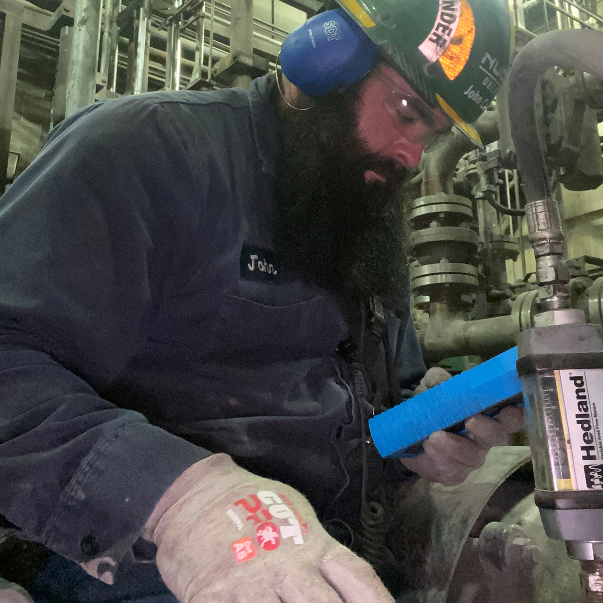

## Former Live Online Level One Student John Garrison Testimonial & Case Study 

## John Garrison is a SDT Level One Trained Ultrasound Inspector working as a Melt Shop Mechanical Technician in Alabama. This is part of his reliability journey as told by him. 

As a mechanic in charge of a portion of the mill, safety and reliability is a must for myself, my company, and our customers. Giving our Operations group the best equipment and training possible is key to our success. For years we have outsourced the vibration, oil, and thermal analysis of our predictive maintenance program, and for years we have thought it was acceptable. But I can recall many occasions when components said to be good, turned out to be bad, or components said to be bad, turned out good. It was clear that our reliability program needed more. 

I was approached by management and asked to lead an ultrasound campaign to improve our reliability program. The first thing we did was buy an [SDT270](https://sdtultrasound.com/products/sdt270/) unit. When it arrived, I found myself staring at an expensive, little blue box which I had no clue what to do with. Shortly after I discovered SDT had a [Live Online Level 1 Class](https://sdt.training/online-ultrasound-training-level-1-certification/) starting soon, so I registered. I was pleased with all the additional on-demand webinars, lessons, and hours of learning from experienced reliability professionals that also came with the course.  

The structure of this class was phenomenal and suited to the way I learn, who wants to sit in class for 8 hours a day? Definitely not me! This class takes place over 8 weeks, 2 classes a week 2 hours each class. This helped me retain the information learned and gave me the time in between classes to go out in the field and practice what I had learned! Paul Klimuc, SDT’s Level 1 instructor is very engaging with the class and gets students involved. He has a way of teaching that sticks with you. I was able to learn the 8 pillars of ultrasound, their applications to my facility, as well as the process of heterodyning which is how the SDT units converts ultrasound signals to audible signals for us to listen to, and much, much more! We also dove deep into the UAS3 software, learning how to build equipment lists, and work surveys. Each class began 30 minutes early for questions, concerns, or just general friendly chit chat, as well as ended late for more of the same. The most common theme throughout the course was Paul driving home the point of safety. 

I would recommend this course to anyone interested in becoming more familiar with ultrasound regardless of current skill set. There is something to be learned for all levels of ultrasound inspectors. While some classes make you feel like a prisoner voluntold to be there, not here. It is fun, engaging, and flourished with a plethora of useful knowledge and information. In the short 8 weeks of this class, I have found several failing components in our mill. I’ve been able to prevent unplanned downtime multiple times by planning to change the components on our time rather than running them to failure. 

## Main Hoist Input Shaft Bearing on Crane

On June 2, 2021, I was asked to check a main hoist input shaft bearing on a crane. Vibration analysis is not very useful for this application because of the amount of vibration and movement the crane makes. We knew ultrasound was the way to go. Upon arrival to the crane, I began listening to the bearings on the input shaft and the brake drum side of the gear box. Immediately, I recognized something didn’t sound right. I made it known to the crane technicians and went to upload the data to [UAS3](https://sdtultrasound.com/products/software/uas3/) so I could perform my analysis. I immediately recognized very high peaks in the wave form as well as an audio signal full of impacts. 

I immediately went back to the crane technicians to review with them the data I had found. I briefed them on the 4 condition indicators (41.7 dBµv rms, 43.9 dBµv max rms, 65.9 dBµv peak, and 16.2 crest factor).  

The crane crew technicians had two reservations… One being I haven’t been doing ultrasound analysis long, and the other was that this was the newest bearing on the crane being installed less than a month ago. The resulting action was that the bearings weren’t changed even though the following week was a down day and the repair could have been a planned. Unfortunately, it wasn’t and two weeks later the bearing failed. The unplanned downtime to repair the damaged input shaft and replace the bearing took approximately 6 hours. The loss of production was expensive enough, not to mention the cost of parts and labor.  

Since the repair was made, the crane technicians have much more belief in ultrasound technology, and we have been routinely monitoring the bearings on the crane.   

Below is the input shaft bearing right after being pulled out of the gearbox. As you can see all the rollers are gone and had to be fished out of the bottom of the gearbox. Fortunately, they didn’t get caught in the gears causing further problems.  

## Pillow Block Bearing Analysis and Repair

Just the other day I was taking some bearing readings. Some of which turned out to be bad, so I informed the mechanics responsible for that area of the plant. Coincidentally, our vibration analyst contractors were performing their analysis on the very same bearings the next day. Their report came back indicating that the bearings were in fact good, causing debate amongst the mechanics as to whether the bearings should be changed or not. After presenting my case with the 4 condition indicators, letting them listen to the audio of each bad bearings alongside their time waveform, and taking them to the bearings so they could feel the popping, and heat generated by the excessive friction for themselves, they opted to change them. It turns out the bearings were indeed bad. The vibration analysts couldn’t believe it. They immediately started questioning me about ultrasound, and how I was able to detect problems with those bearings they weren’t. I simply told them that SDT just “Hears More.” 

I will end this story on the most important thing covered in SDT’s Live Online Level One Certification! SAFETY! I can now use my ultrasound equipment to do my job more safely, limiting break downs, and keeping my fellow team members out of harm’s way. Sending my team home every day to their families the way they came to work is the most important accomplishment we can do in the industry. So, if you want to “Hear more” [sign up for this course](https://sdt.training/online-ultrasound-training-level-1-certification/) you won’t regret it! And in the words of Paul said every class:

## “FFF” (Family, Friends, and Fingers)! 

