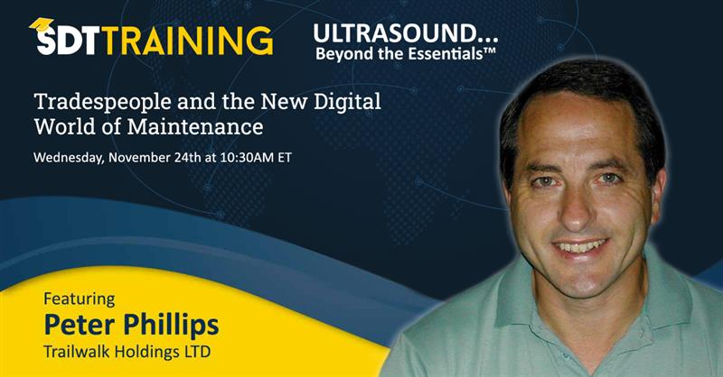

A digital revolution is upon us. As of right now, tradespeople require ever-improving skills just to keep pace with the rapid digitalization of modern maintenance strategies. Improving all around digital skills and familiarizing tradespeople with new maintenance technologies is the most important factor for reliability teams adapting modern maintenance best practices.

A look at the current maintenance workforce shows a significant generational gap between new and experienced workers. Younger tradespeople benefitted from growing up in a society full of technological advances, therefore they’re better suited to adapting new software and digital best practices into their daily maintenance routine.

As maintenance departments modernize their systems, senior tradespeople without the same digital skillset fall behind.

In the next 10 years, much of the experienced maintenance workforce will retire, leaving younger, more technologically adept replacements to fill their shoes. Trades school will have prepared tomorrow’s maintenance workers for the digital world of maintenance. But in the meantime, maintenance departments have an obligation to their senior workforce to teach new digital technology and continuously provide them with the means to perform their jobs at a high level.

At CertainTeed Gypsum, where I work as a Maintenance Support Manager involved with the implementation of any new digitalized maintenance systems, I came to a stark realization. There is an unproportionate amount of emphasis put on the experienced maintenance workforce developing new digital skills, when compared to the amount of new digital maintenance technology being implemented.

CertainTeed Gypsum is amidst a rapid advancement in maintenance systems technology. In the past 2 years across North America, CertainTeed Gypsum has introduced:
>* A new CMMS system with all new work order processes.
>* Work Order Mobility for trades to process their work orders using a tablet application, making paperwork orders obsolete.
>* Tablets integrated with HMI and other manufacturing process and equipment controls.
>* Complete digitization of equipment resources and documentation.
>* Laser Alignment and Chain Tension applications.
>* Remote equipment sensor software for vibration and temperature.

The learning curve for the younger generation of tradespeople is much smaller than that of the older generation. Yet, the implementation training each party receives is essentially the same. When these experienced tradespeople aren’t helped in overcoming their lack of digital skills, their attitudes towards the new maintenance technology gears towards frustration. And their working habits will often revert to the old way of doing things.

But my time at CertainTeed Gypsum, as well as talking to other industry professionals has taught me there are mechanisms that maintenance teams and training departments can deploy to ensure the older generation of maintenance technicians flourish using new advanced maintenance technology.

My good friend Bob Purcell recently retired from Rockwell Automation after being an Allen Bradley PLC and Control Logic Systems Trainer these past 30 years. He started his career as an industrial electrician and controls tradesperson. Before going to work for Rockwell, Bob went back to college to obtain his teaching license. Him and I have often discussed the challenges maintenance departments encounter when implementing new technology. Our conclusion is that maintenance app developers need to shift their focus from a management perspective, to focus more on the usability of the application from maintenances point of view.

Management wants to see the report. They’re interested in the KPI’s and analysis capabilities of the new program. So that’s what digital maintenance app developers set their focus to. Bob would like to see efforts shifted towards ensuring the app is first effective, and second easy to use.

He likes to approach his training from a tradespersons point of view, by illustrating what the new technology can do for the maintenance department. Bob understands the successful implementation of a new digital tool depends solely on its simplicity and ease of use. Simply because learning a new digital technology can be extremely frustrating… frustration and learning do not coincide well.

Bob noticed when Control Logic Systems were designed and programmed to be user-centric, maintenance personnel both old and young were able to better understand the software, more effectively troubleshoot equipment, all while buying into technology changes.

When done correctly, the program becomes the engine to run the equipment or processes, and it also becomes a tool to fix it. As an example, in early versions of PLC the computer that the program was loaded on was very limited. Without enough memory space to add complete descriptions of inputs and outputs on the ladder logic design, maintenance tradespeople weren’t hesitant to write it off. But advancements in computers and Control Logic Systems have erased any previous concerns regarding memory storage; allowing for near limitless input and output descriptions.

For example, Instead of the input/output device being named something like:

>“-[ ]- X1”

It can now be be named:

>“-[ ]- Left Conveyor Photocell”

When the Logics Program properly describes the elements of the processes, it becomes a tremendous troubleshooting tool for maintenance personnel.

The changes in technology that myself, Bob, and others like us have witnessed are a shining example that any tool purchased or developed for maintenance people needs to be simple and easy to use. Of course, another necessity is the programs’ ability to deliver the analysis management requires – but the number one priority that remains is usability for tradespeople. If the application is difficult for tradespeople to use, they will not use it. And all the fancy reporting and analysis will be for not.

Technology in the maintenance world is here to stay. We need to consider all stakeholders when planning new digital maintenance systems. If personnel from all levels of the organization will be using the technology, then it needs to be developed from the bottom up, not the top down. Because the people who use it the most will ultimately be the ones determining whether it sinks or swim.

Join Peter on the next episode of Ultrasound... Beyond the Essentials when he will be discussing these topics. Use the link below!

[Click here to register for the Webinar](https://sdt.training/tradespeople-and-the-new-digital-world-of-maintenance-with-peter-phillips/)